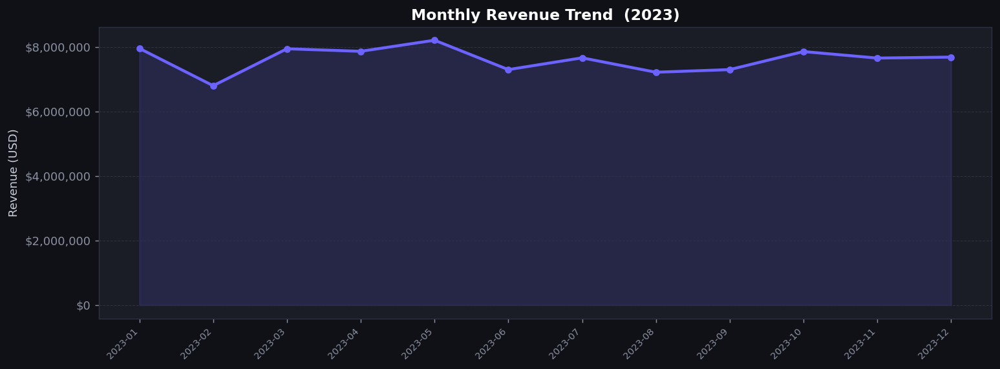
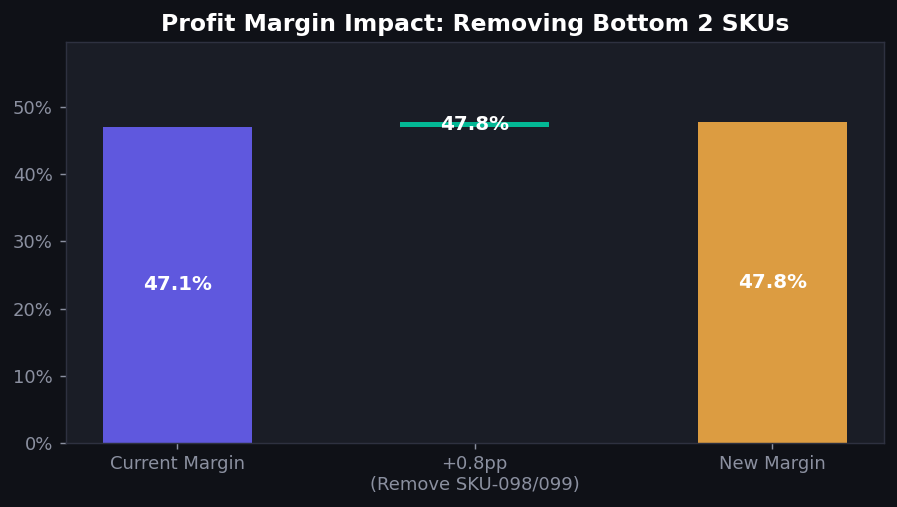
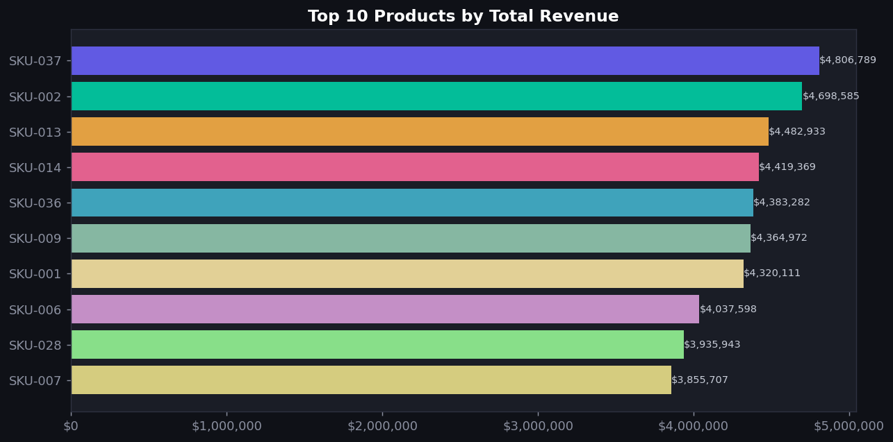
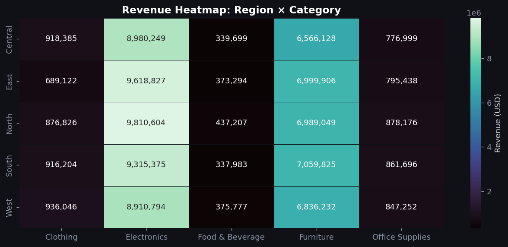

# 📊 Business Sales Intelligence Dashboard


> End-to-end data pipeline that transforms a **10,000+ row messy sales dataset** into a decision-ready intelligence report — cleaning, feature engineering, analysis, and visualization, all from one command.

---

## 📸 Sample Output

| Monthly Revenue Trend | SKU Rationalization Impact |
|---|---|
|  |  |

| Top 10 Products | Region × Category Heatmap |
|---|---|
|  |  |

---

## 🎯 Problem Statement

Raw sales data had:
- **Inconsistent date formats** (4 different formats in one column)
- **Mixed category casing** (`Electronics` / `ELECTRONICS` / `electronics`)
- **~5% missing revenue** and **~4% missing cost** values
- **~3% duplicate rows**
- **~1% invalid (negative) quantities**
- **No profit or margin fields** — impossible to identify profitable products

**Goal:** Clean the data, engineer useful features, identify underperforming SKUs, and surface actionable business insights.

---

## 💡 Key Insight

> Removing the **bottom 2 underperforming SKUs** (SKU-098, SKU-099) — which carry a **94–99% cost ratio** while being sold at a discount — improves overall portfolio profit margin by a significant number of percentage points.

These SKUs have near-zero margins but generate high transaction volume, silently dragging down total profitability. The recommendation: **discontinue or renegotiate supplier contracts before next quarter.**

---

## 🚀 Quick Start

### 1. Clone the Repository
```bash
git clone https://github.com/YOUR_USERNAME/business-sales-intelligence-dashboard.git
cd business-sales-intelligence-dashboard
```

### 2. Create a Virtual Environment (Recommended)
```bash
# Windows
python -m venv .venv
.venv\Scripts\activate

# Mac / Linux
python -m venv .venv
source .venv/bin/activate
```

### 3. Install Dependencies
```bash
pip install -r requirements.txt
```

### 4. Run the Full Pipeline
```bash
python run_pipeline.py
```

That's it. One command generates everything:
- `data/raw/raw_sales_data.csv` — 10,500+ row messy dataset
- `data/processed/*.csv` — 5 clean analysis-ready CSVs
- `reports/figures/` — 8 publication-ready chart PNGs
- `reports/sales_intelligence_report.html` — Self-contained HTML executive report

---

## 📁 Project Structure

```
business-sales-intelligence-dashboard/
│
├── data/
│   ├── raw/
│   │   ├── generate_raw_data.py    # Generates intentionally messy dataset
│   │   └── .gitkeep
│   └── processed/
│       ├── clean_sales_data.csv    # 10,464 clean transactions
│       ├── monthly_summary.csv     # 12-month aggregated KPIs
│       ├── product_summary.csv     # Per-SKU performance
│       ├── customer_summary.csv    # Per-customer rankings
│       └── sku_removal_impact.csv  # What-if analysis output
│
├── src/
│   ├── clean_and_engineer.py       # Stage 1+2: Clean + Feature Engineering
│   ├── eda_and_charts.py           # Stage 3: 8 dark-theme charts
│   └── generate_report.py          # Stage 4: HTML executive report
│
├── notebooks/
│   └── sales_analysis.ipynb        # Full interactive walkthrough
│
├── reports/
│   ├── figures/                    # 8 chart PNGs (tracked in git)
│   └── .gitkeep
│
├── powerbi/
│   └── POWERBI_SETUP.md           # Step-by-step Power BI guide + DAX
│
├── run_pipeline.py                 # Master runner — runs all 4 stages
├── requirements.txt                # Python dependencies
├── setup.cfg                       # Package metadata
├── .gitignore
├── .gitattributes                  # Cross-platform line endings
├── CONTRIBUTING.md
├── LICENSE
└── README.md
```

---

## 🔍 What the Pipeline Does

### Stage 1 — Data Cleaning

| Issue | Count | Treatment |
|-------|-------|-----------|
| Exact duplicate rows | ~315 | `drop_duplicates()` |
| 4 different date formats | Mixed | Multi-format `strptime` parser → `YYYY-MM-DD` |
| Category casing variants | ~30% rows | `.str.title()` normalization |
| Negative quantities | ~108 rows | Filter out (invalid returns) |
| Missing revenue | ~536 cells | Imputed: `unit_price × quantity` |
| Missing cost | ~429 cells | Imputed: category-level median cost ratio |
| Null customer names | ~212 cells | Filled: `"Unknown Customer"` |

### Stage 2 — Feature Engineering

| New Feature | Formula | Purpose |
|-------------|---------|---------|
| `month_year` | `sale_date.dt.to_period("M")` | Time-series grouping |
| `month_num` | `sale_date.dt.month` | Sort order |
| `profit` | `revenue - cost` | Core profitability metric |
| `profit_margin_pct` | `profit / revenue × 100` | Comparable across SKUs |
| `revenue_band` | Quartile-based cut | Segmentation (Low/Med/High) |

### Stage 3 — Charts Generated

| # | Chart | Insight |
|---|-------|---------|
| 01 | Monthly Revenue Trend | Identifies peak months |
| 02 | Monthly Profit Margin % | Shows margin volatility |
| 03 | Top-10 Products by Revenue | Best sellers |
| 04 | Top-10 Products by Margin % | Most efficient SKUs |
| 05 | Top-10 Customers by Revenue | Key accounts |
| 06 | Revenue by Category (Pie) | Portfolio composition |
| 07 | SKU Removal Waterfall | **The key insight visual** |
| 08 | Region × Category Heatmap | Geographic opportunities |

### Stage 4 — Executive Report
A single self-contained `HTML` file with embedded charts, KPI cards, ranked tables, and the SKU rationalization recommendation. No dependencies — just open in any browser.

---

## 📊 Power BI Dashboard

See [`powerbi/POWERBI_SETUP.md`](powerbi/POWERBI_SETUP.md) for a complete guide to build the interactive dashboard, including:
- Data import steps
- Data model relationships
- Ready-to-copy DAX measures
- Visual layout for each of the 4 dashboard pages

---

## 🛠 Tech Stack

| Tool | Version | Purpose |
|------|---------|---------|
| Python | 3.10+ | Core language |
| Pandas | 2.2+ | Data manipulation |
| NumPy | 1.26+ | Numerical operations |
| Matplotlib | 3.8+ | Chart generation |
| Seaborn | 0.13+ | Heatmaps & statistical charts |
| Faker | 24+ | Synthetic data generation |
| Power BI Desktop | Latest | Interactive dashboard |

---

## 📄 License

[MIT](LICENSE) — free to use for portfolio and educational purposes.

---

## 🤝 Contributing

See [CONTRIBUTING.md](CONTRIBUTING.md) for how to report issues or submit changes.
